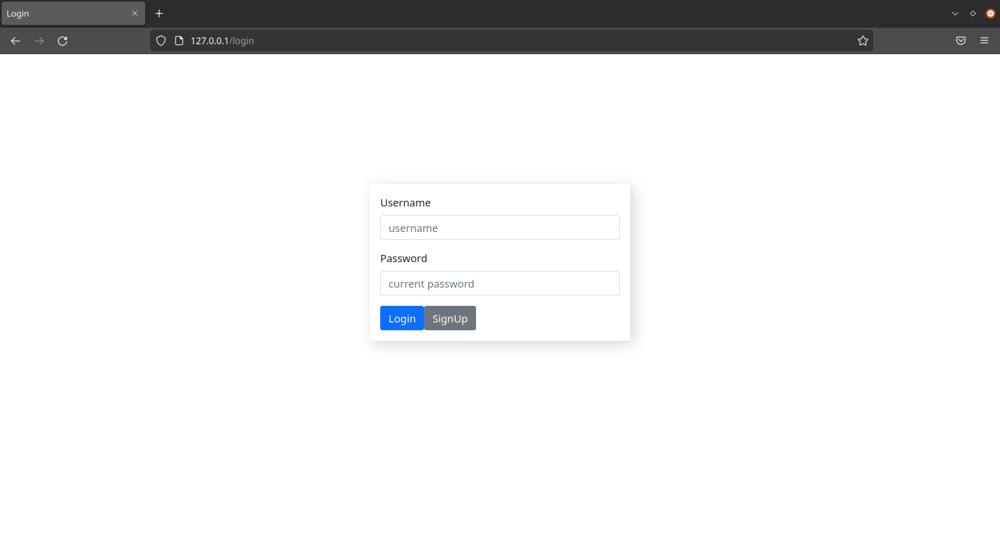
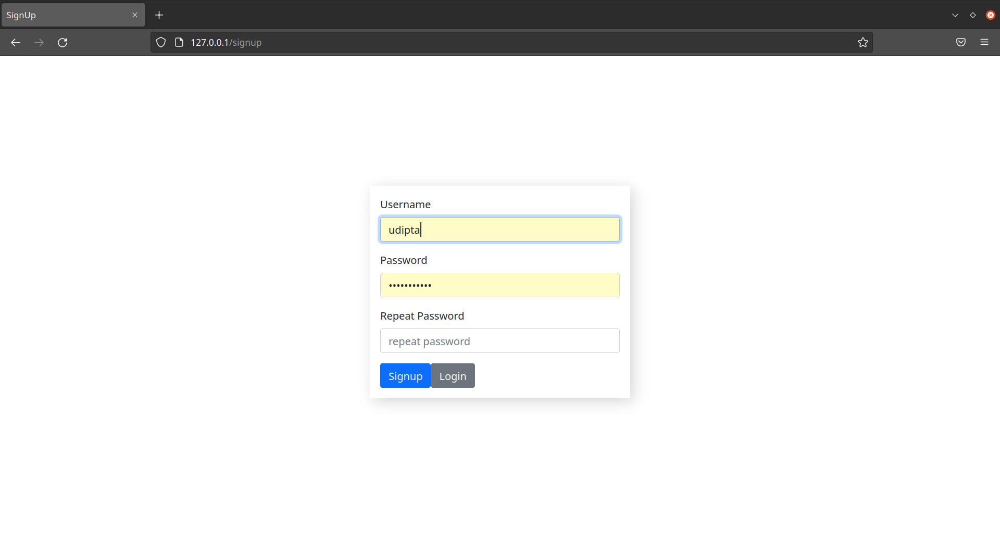
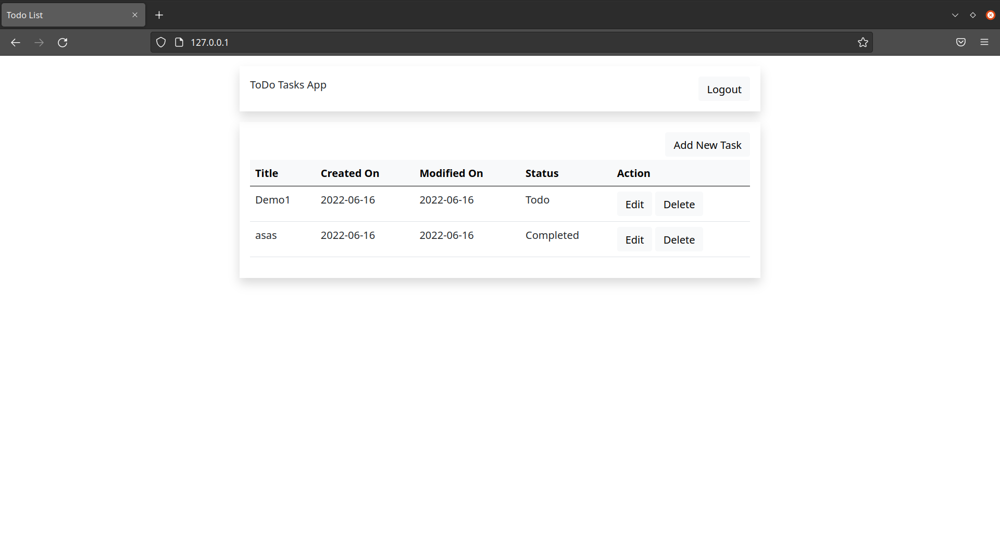

# To-Do Task App
***

<h4> TechStack Used</h4>
1. Python (Programming Language) 
2. Django (Web Framework) 
3. Postgres (Database) 
5. ReactJS (Fronted Framework) 
5. Nginx  

***

<h5> Webpage ScreenShots</h5>
<h6> 1. Login </h6>

| Status  | Time  | Size  |
| ------- |-------|-------|
| 200 OK  | 95 ms | 823 B |

<h6> 2. Sign Up </h6>

| Status  | Time  | Size  |
| ------- |-------|-------|
| 201 OK  | 108ms | 800 B |

<h6> 3. Dashboard </h6>

<h6> 4. Create Task </h6>

<h6> 5. Edit Task </h6>

<h6> 6. Delete Task </h6>

<h5><a href="https://www.getpostman.com/collections/f9cf7d85df46ac1d89a6"> Postman Collection</a></h5>

***

<h5> How to set up and run locally </h5>

  1. Clone the Repository  
  2. After activating the virtual enviornment, redirect to project base directory.  
  3. Build and run the docker-compose

    docker-compose up --build

 
  5. Create superuser for accessing the dashboard as admin

    $ docker exec -it todo_list bash
    $ python3 manage.py createsuperuser
 
  6. To access the dashboard checkout <a href="http://127.0.0.1/">here</a>
 
